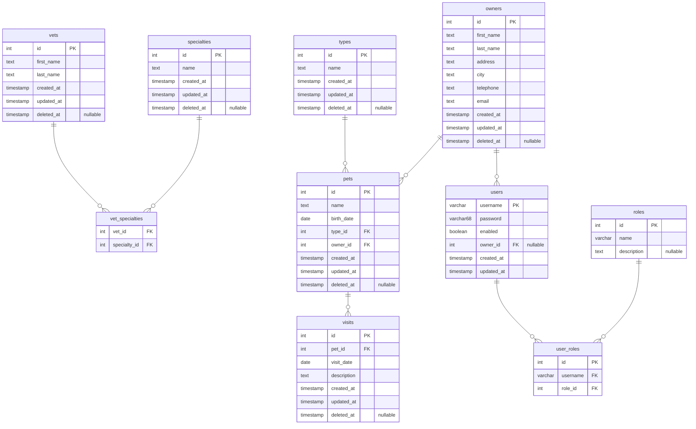

# Petclinic

This repository provides the shared persistence layer for the Petclinic domain — a PostgreSQL database managed via [Flyway](https://flywaydb.org/) migrations, Dockerized with supporting tools.

It is the foundation that sibling application repos (e.g. `petclinic-java`, `petclinic-kotlin`, `petclinic-scala`) are expected to consume as their database backend. Those repos do not exist yet, but the repository layout is designed for them to live alongside this one and connect to `localhost:5432`.

## What's Inside

| Service    | Image                         | Port  | Purpose                             |
|------------|-------------------------------|-------|-------------------------------------|
| `postgres` | `postgres:18-alpine`          | 5432  | Database server                     |
| `flyway`   | `flyway/flyway:10-alpine`     | —     | Schema migrations and seed data     |
| `pgadmin`  | `dpage/pgadmin4:latest`       | 5050  | Web-based database admin UI         |

- **Database name:** `petclinic`
- **Credentials:** `petclinic` / `petclinic`

## Quick Start

```bash
docker compose up -d --build
```

This starts PostgreSQL, runs Flyway migrations (creating tables and seeding data), and launches pgAdmin.

### Access pgAdmin

Open [http://localhost:5050](http://localhost:5050) and log in with:

- **Email:** `admin@petclinic.com`
- **Password:** `admin`

Then add a server connection:

- **Host:** `postgres`
- **Port:** `5432`
- **Username:** `petclinic`
- **Password:** `petclinic`

### Migrations

SQL migration files live in `db/flyway/sql/`. Add a new file following the naming convention `V<version>__<description>.sql` and restart Flyway:

```bash
docker compose up -d --build flyway
```

### Seeding

Flyway also handles seed data. After running migrations, the database is populated with sample vets, specialties, pet types, owners, pets, visits, and a default admin user:

- **Username:** `admin`
- **Password:** `admin`

The admin user has `ROLE_OWNER_ADMIN`, `ROLE_VET_ADMIN`, and `ROLE_ADMIN` roles.

## Schema Design & Decisions

### ER Diagram



### Inspiration Sources

| Source | What was taken |
|--------|---------------|
| [spring-projects/spring-petclinic](https://github.com/spring-projects/spring-petclinic/tree/main/src/main/resources/db/postgres) | The 7 domain tables and seed data (vets, specialties, types, owners, pets, visits) |
| [spring-petclinic-rest](https://github.com/spring-petclinic/spring-petclinic-rest) | The `users` table and role-based authorization model |

### Design Decisions

| Decision | Rationale |
|----------|-----------|
| **`NOT NULL` on required fields** | Enforces data quality at the DB level rather than relying solely on application validation. |
| **`owners.email`** | Essential for any real communication; missing from every official petclinic schema. |
| **Audit columns (`created_at`, `updated_at`) on all tables** | Provides basic traceability without adding an event log table. |
| **Soft delete (`deleted_at`) on domain tables** | Prevents accidental data loss — medical history should never be hard-deleted. |
| **`owner_id` on `users`** | Links authenticated users to their owner record without a separate `user_profiles` table. Simple, avoids column duplication. |
| **Vets not unified into `users`** | `vets` is pure domain data. Auth-to-vet mapping is an app-layer concern; coupling it here would force all consumers into that model. |
| **Normalized roles (`roles` + `user_roles`)** | `roles` stores reusable role definitions (name + description); `user_roles` maps users to roles via a join table. Decouples role definitions from user assignments for cleaner permission management. |
| **Flat address (no structured street/city/state/zip)** | The flat `address` + `city` model is pragmatic for a demo. |
| **Visits kept lean (`visit_date` + `description`)** | Avoids scope creep. Diagnosis, cost, etc. can be added via future migrations. |
| **`ON DELETE CASCADE` on join/child tables** | `vet_specialties`, `visits`, and `user_roles` cascade to keep the DB clean when parent records are removed. |
| **`ON DELETE SET NULL` on `users.owner_id`** | Deleting an owner record should not delete the user account — just break the link. |
| **`ON DELETE RESTRICT` on `pets.type_id` and `pets.owner_id`** | Prevents accidental deletion of types or owners that still have associated pets. |
| **Bcrypt passwords (`VARCHAR(68)`)** | Accommodates bcrypt hashes (60 chars) plus room for future hash algorithm changes. The admin seed uses a bcrypt hash of `admin`. |


## Project Layout

```
petclinic/
├── db/flyway/       # Flyway Dockerfile, config, and SQL migrations
├── docs/            # Documentation assets (ER diagram, etc.)
├── .env             # Shared environment variables
├── docker-compose.yml
└── README.md
```

Sibling repos (`petclinic-java/`, `petclinic-kotlin/`, etc.) are expected to reside at the same directory level as this repo and connect to the database at `localhost:5432`.
