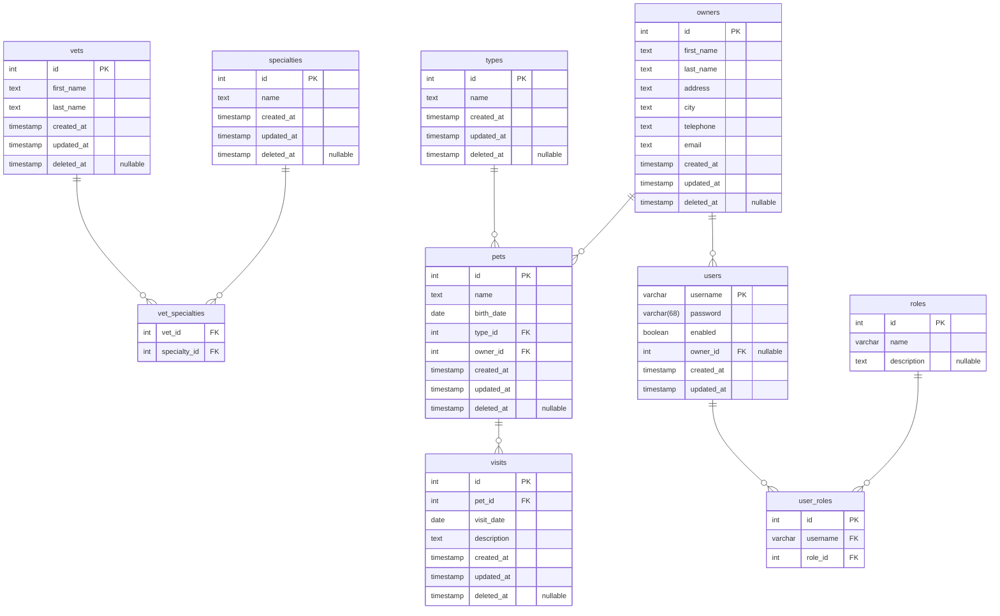

# Petclinic

This repository implements the classic [Spring Petclinic](https://github.com/spring-projects/spring-petclinic) application across multiple tech stacks — all sharing a single PostgreSQL database managed via [Flyway](https://flywaydb.org/) migrations.

## Quick Start

```sh
docker compose up -d --build
```

This starts PostgreSQL, runs Flyway migrations (creating tables and seeding data), and launches pgAdmin.


| Service    | Image                         | Port  | Purpose                             |
|------------|-------------------------------|-------|-------------------------------------|
| `postgres` | `postgres:18-alpine`          | 5432  | Database server                     |
| `flyway`   | `flyway/flyway:10-alpine`     | —     | Schema migrations and seed data     |
| `pgadmin`  | `dpage/pgadmin4:latest`       | 5050  | Web-based database admin UI         |

### Access pgAdmin

Open [http://localhost:5050](http://localhost:5050) and log in with:

- **Email:** `admin@petclinic.com`
- **Password:** `admin`

Then add a server connection:

- **Host:** `postgres`
- **Port:** `5432`
- **Username:** `petclinic`
- **Password:** `petclinic`

### Migrations

SQL migration files live in `db/flyway/sql/`. Add a new file following the naming convention `V<version>__<description>.sql` and restart Flyway:

```bash
docker compose up -d --build flyway
```

### Seeding

Flyway also handles seed data. After running migrations, the database is populated with sample vets, specialties, pet types, owners, pets, visits, and a default admin user:

- **Username:** `admin`
- **Password:** `admin`

The admin user has `ROLE_OWNER_ADMIN`, `ROLE_VET_ADMIN`, and `ROLE_ADMIN` roles.

## Project Layout

```
petclinic/
├── db/flyway/                                                  # Flyway Dockerfile, config, and SQL migrations
├── .env                                                        # Shared environment variables
├── docker-compose.yml
├── petclinic-java-gradle-react-tailwind-ts/                    # Flagship — Java + React + Tailwind CSS + TypeScript
├── petclinic-kt-gradle-thymeleaf-tailwind-webpack-htmx-ts/     # Satellite — Kotlin + Thymeleaf + HTMX + Tailwind CSS + TypeScript
├── petclinic-.../                                              # Other future versions
└── README.md                                                   # This document
```

As of now, both `petclinic-*` projects are Bootify scaffolds.

- The flagship will carry the deep work (OpenAPI-first API, JWT auth, React SPA, hexagonal architecture, observability).
- The satellite(s) may be a deliberately shallow counterpart on the same database.

All applications connect to the database at `localhost:5432` on port `8080`. Each project loads database credentials from its own `.env` file — copy the `.env.example` to `.env` for a working setup.

## Schema Design

### ER Diagram



### Inspiration Sources

| Source | What was taken |
|--------|---------------|
| [spring-projects/spring-petclinic](https://github.com/spring-projects/spring-petclinic/tree/main/src/main/resources/db/postgres) | The 7 domain tables and seed data (vets, specialties, types, owners, pets, visits) |
| [spring-petclinic-rest](https://github.com/spring-petclinic/spring-petclinic-rest) | The `users` table and role-based authorization model |

### Design Decisions

| Decision | Rationale |
|----------|-----------|
| **`NOT NULL` on required fields** | Enforces data quality at the DB level rather than relying solely on application validation. |
| **`owners.email`** | Even though communication is out of scope, it would be essential for any real communication; missing from every official petclinic schema. |
| **Audit columns (`created_at`, `updated_at`) on all tables** | Provides basic traceability without adding an event log table. |
| **Soft delete (`deleted_at`) on domain tables** | Prevents accidental data loss — medical history should never be hard-deleted. |
| **`owner_id` on `users`** | Links authenticated users to their owner record without a separate `user_profiles` table. Simple, avoids column duplication. |
| **Vets not unified into `users`** | `vets` is pure domain data. Auth-to-vet mapping is an app-layer concern; coupling it here would force all consumers into that model. |
| **Normalized roles (`roles` + `user_roles`)** | `roles` stores reusable role definitions (name + description); `user_roles` maps users to roles via a join table. Decouples role definitions from user assignments for cleaner permission management. |
| **Flat address (no structured street/city/state/zip)** | The flat `address` + `city` model is pragmatic for a demo. |
| **Visits kept lean (`visit_date` + `description`)** | Avoids scope creep. Diagnosis, cost, etc. can be added via future migrations. |
| **`ON DELETE CASCADE` on join/child tables** | `vet_specialties`, `visits`, and `user_roles` cascade to keep the DB clean when parent records are removed. |
| **`ON DELETE SET NULL` on `users.owner_id`** | Deleting an owner record should not delete the user account — just break the link. |
| **`ON DELETE RESTRICT` on `pets.type_id` and `pets.owner_id`** | Prevents accidental deletion of types or owners that still have associated pets. |
| **Bcrypt passwords (`VARCHAR(68)`)** | Accommodates bcrypt hashes (60 chars) plus room for future hash algorithm changes. The admin seed uses a bcrypt hash of `admin`. |

## Scope

Definitions for user flows and screen contents that are **in scope** for the Petclinic app(s)

- **Single persona**: a staff member (the seeded `admin` user). Flows are written for that persona; role restrictions are not enforced yet.
- **Deliberately small**: out-of-scope features are listed explicitly at the end.
- **Styling**: Tailwind v4 is the preferred styling approach where applicable.

### Actors & role gates

| Actor | Description | Seeded account |
|---|---|---|
| Staff member | Runs the clinic day-to-day: manages owners, pets, visits, vets, and reference data. | `admin` / `admin` |

Future role gates (not enforced yet):

| Role | Intended access |
|---|---|
| `ROLE_OWNER_ADMIN` | Owner, pet, and visit flows (find, view, create, edit, delete) |
| `ROLE_VET_ADMIN` | Vet directory — read for all staff, create/edit/delete for this role |
| `ROLE_ADMIN` | Everything, including the Administration screens |

Until enforcement exists, any logged-in staff member can reach everything.

### Sitemap & navigation

```
Home
Owners
  └─ Find owner (list + search)
       └─ Owner detail          ← hub of the owner flows
            ├─ Add / edit owner
            ├─ Add / edit / delete pet
            └─ Record / delete visit
Vets
  └─ Vets directory (list) + add / edit / delete vet
Administration ▾
  ├─ Pet types (list + add / edit / delete)
  └─ Specialties (list + add / edit / delete)
Login / Logout
```

- Side navigation: **Home, Owners, Vets**, **Administration ▾** (expandable group), and a login/logout control at the bottom showing the current user's username. Brand sits at the top of the sidebar.
- Pets and visits are **not** top-level entries. Their primary path is owner-scoped, from the owner detail screen. Legacy flat list screens for pets and visits may remain reachable under Administration for maintenance, but they are low priority and are not part of the primary flows.
- Everything except Login/Logout is behind authentication.

### Shared Patterns

- Fixed side navigation bar on the left: brand at the top, nav links below it, login/logout control with the current user's username at the bottom.
- Dedicated screens for 403 (no permission) and 404 (not found), with a link back Home.
- Table patterns
	- Header row with column titles.
	- One row per record with a trailing **Actions** column (view/edit/delete).
	- Empty state: short message + primary action button when relevant.
	- Pagination.
- Form patterns
	- Labeled inputs
	- Inline validation: error text under the failing field; server-side validation errors rendered the same way.
	- Action row: **Save** (primary) + **Cancel** (returns to the previous screen).
	- Deletes require a confirmation step before executing.
- Feedback patterns
	- Success: confirm the completed action (e.g., "Owner saved") on the screen you land on after the action.
	- Error: explain what failed, inline where possible.

### Out of scope

- User registration and user/role management screens
- Pet-owner self-service portal (owners logging in to manage their own data)
- Vet schedules, appointment booking, or calendar views
- Invoicing / payments
- Visits covering multiple pets in one submission
- Pet photos / file uploads
- Any search beyond owner last name (no vet, pet, or visit search)
- Enforcement of the role gates above (documented for later only)
- Notifications / email